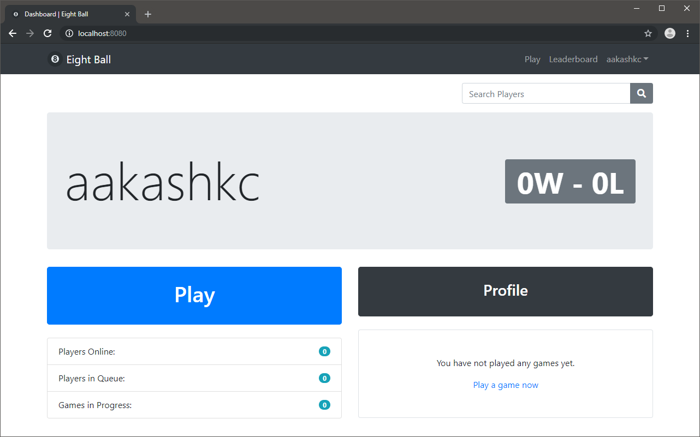
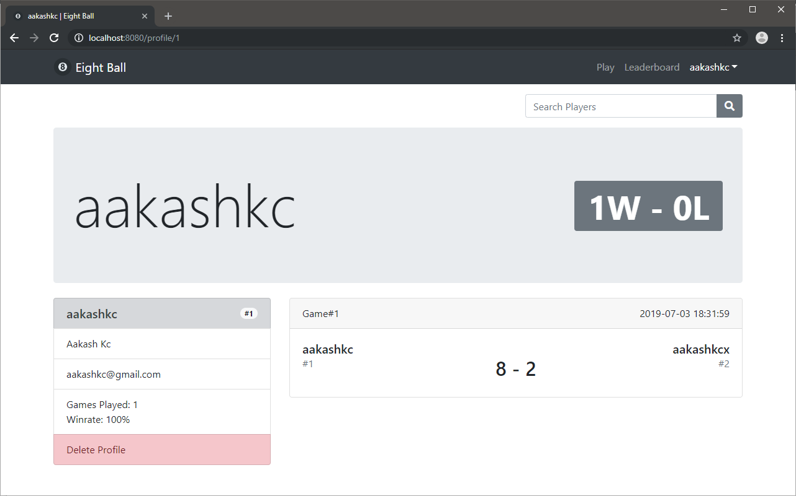
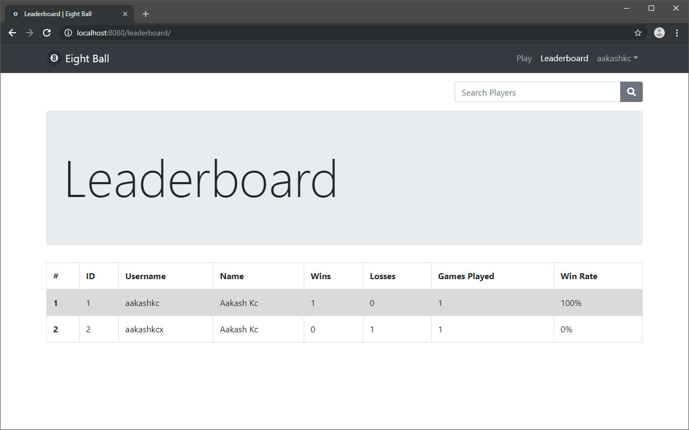

A multiplayer 8 ball pool game built using JavaScript, Express, WebSockets, and the Canvas API.

- Game physics: two dimensional elastic collisions using vectors and mechanics.
- Full stack web application with dynamic web pages, user accounts, sessions and authentication.
- Real time communication of game state between server and clients using WebSockets through Socket.IO.

Gameplay:

Physics collisions:

Dashboard page:

Profile page:

Leaderboard page:

