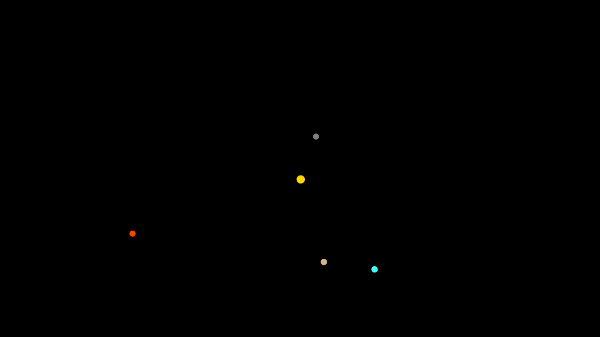
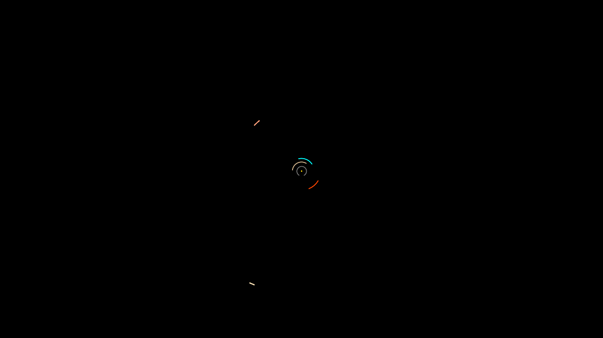

This project builds an accurate model of the solar system using TypeScript, the Canvas API, and real-life physics with [Newton's law of universal gravitation](https://en.wikipedia.org/wiki/Newton%27s_law_of_universal_gravitation).

