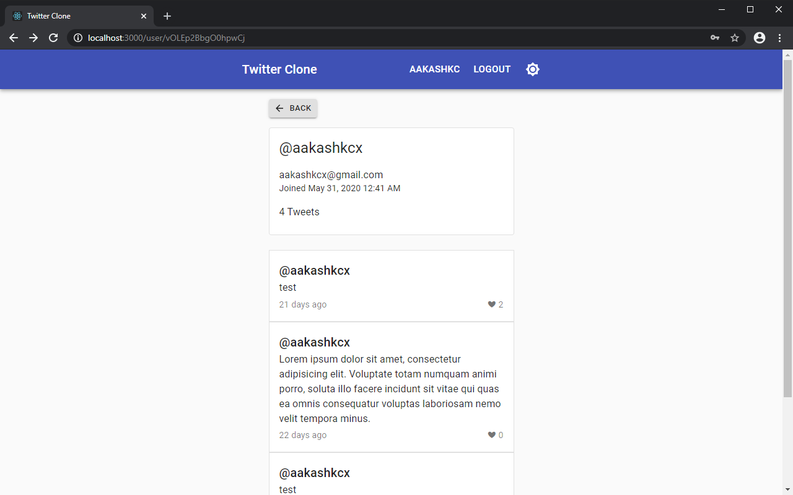
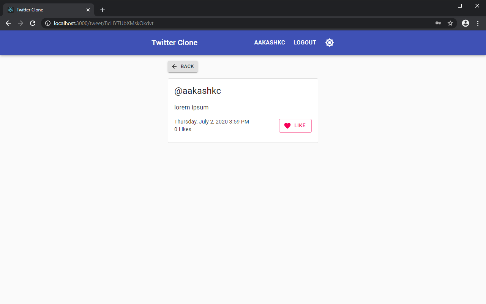
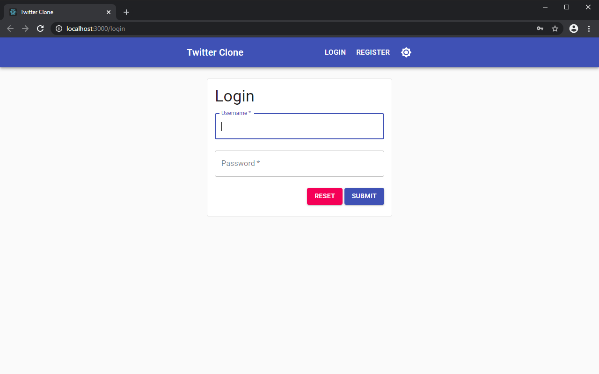

A full stack twitter clone consisting of an Express REST API server and a React single page application.

The server features a RESTful HTTP API, a NoSQL document database, and user authentication and authorisation through JSON Web Tokens (JWTs).

The client features a React single page application (SPA) using Material UI.

Profile page:

Tweet page:

Login page:

