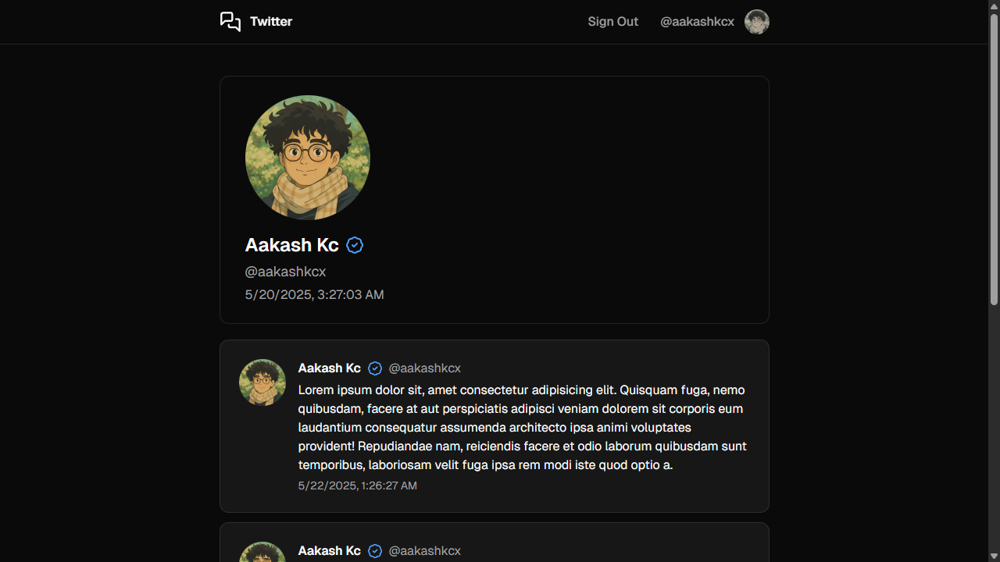

This project features a full-stack web application that clones the core functionality of the social media platform [Twitter](https://x.com/) (now known as X).

The project is built with the following technologies:

- A [Next.js](https://nextjs.org/) web application hosted on [Vercel](https://vercel.com/)
- React [server components](https://react.dev/reference/rsc/server-components) for server-side UI rendering and caching
- Next.js [server actions](https://nextjs.org/docs/app/building-your-application/data-fetching/server-actions-and-mutations) for asynchronous server API calls
- A serverless [PostgreSQL](https://www.postgresql.org/) database hosted on [Neon](https://neon.tech/)
- [Drizzle](https://orm.drizzle.team/) for a TypeScript SQL-like ORM
- [Tailwind CSS](https://tailwindcss.com/) utility classes
- Re-usable and customisable components by [shadcn/ui](https://ui.shadcn.com/)
- Stateless session management using [JSON Web Tokens](https://jwt.io/)
- Light/dark mode by [next-themes](https://github.com/pacocoursey/next-themes)
- [Zod](https://zod.dev/) schema validation with [React Hook Form](https://react-hook-form.com/)

Profile page:

Tweet page:

Login page:

